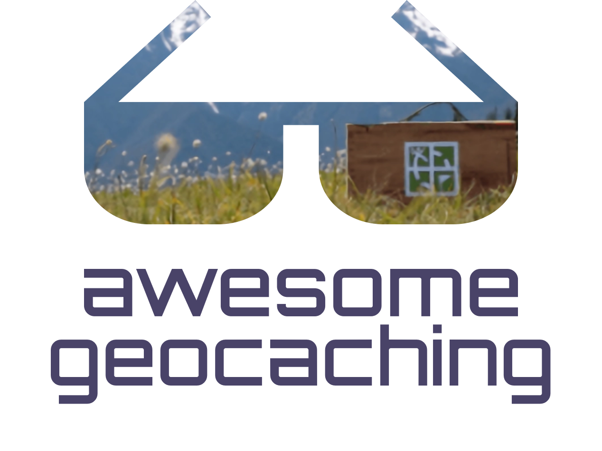

<h1>

	

</h1>

    <a href="https://github.com/sindresorhus/awesome">

> A curated list of assets availible on the Internet related to Geocaching.

[Geocaching](https://en.wikipedia.org/wiki/Geocaching) is an outdoor recreational activity, in which participants use a Global Positioning System receiver or mobile device and other navigational techniques to hide and seek containers, called geocaches or caches, at specific locations marked by coordinates all over the world.

Contributions welcome! Read the [contribution guidelines](contributing.md) first.

⭐ Leave a star if you liked this list!

---

## Contents

- [Websites](#websites)
- [Apps](#apps)
- [Scripts](#scripts)
- [Other](#other)

## Websites

- [Geocaching.com](https://www.geocaching.com/) - Official international website.
- [Project-GC](https://project-gc.com/) - Website that gives a lot of statistics about your geocaching account.
- [GeoCheck](https://geocheck.org/) - Coordinates checker for geocaches.
- [Certitude](https://certitudes.org/) - Tool used to validate solutions for geocaching puzzles.
- [Geocaching.su](https://geocaching.su/) - Website for geocaching in the post-Soviet countries.

## Apps

- [Geocaching®](https://www.geocaching.com/play/mobile) - An official app for geocaching.
- [Wherigo](https://apps.apple.com/us/app/wherigo/id1538051913) - `[iOS]` An official app to play Wherigo geocaches.
- [c:geo](https://play.google.com/store/apps/details?id=cgeo.geocaching) - `[Android]` The most popular free unofficial app for geocaching. Has many tools the official app doesn't have.
- [Cachly](https://www.cachly.com/) - `[iOS]` Paid unofficial app for geocaching. Has many tools the official app doesn't have.
- [Geocaching4Locus](https://geocaching4locus.eu/) - `[Android]` Locus map add-on which allows you to download and import caches directly from Geocaching.com site.
- [GeoGet](https://www.geoget.cz/doku.php/start) - `[Windows]` Geocache manager, where you can manage your final waypoints, add notes or waypoints to geocache or import/export geocache from/to GeoGet.
- [GSAK (Geocaching Swiss Army Knife)](https://gsak.net/index.php/) - `[Windows]` Desktop app for managing geocaches and waypoints.
- [WhereYouGo](https://play.google.com/store/apps/details?id=menion.android.whereyougo&pcampaignid=web_share) - `Android` Open source, unofficial app for playing Whereigo geocaches.

## Scripts

- [GC little helper II](https://github.com/2Abendsegler/GClh/tree/collector) - Powerful tool to enhance and extend the functionality of the geocaching website.

## Other
- [pycaching](https://pypi.org/project/pycaching/3.0.2/) - Python 3 interface for working with Geocaching.com website.
